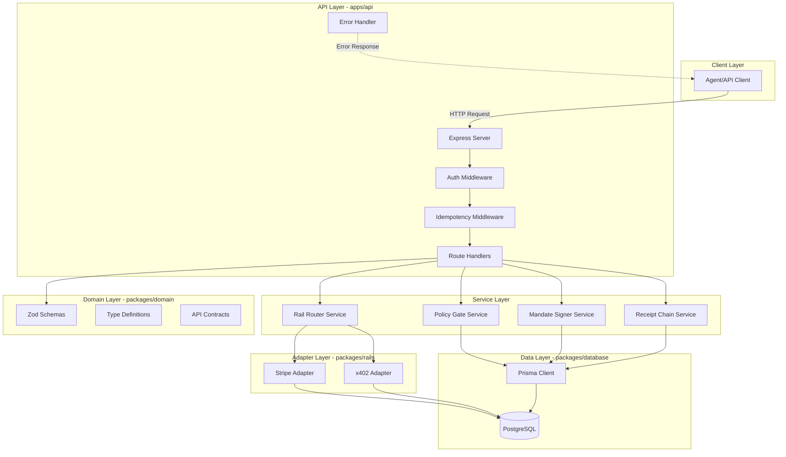
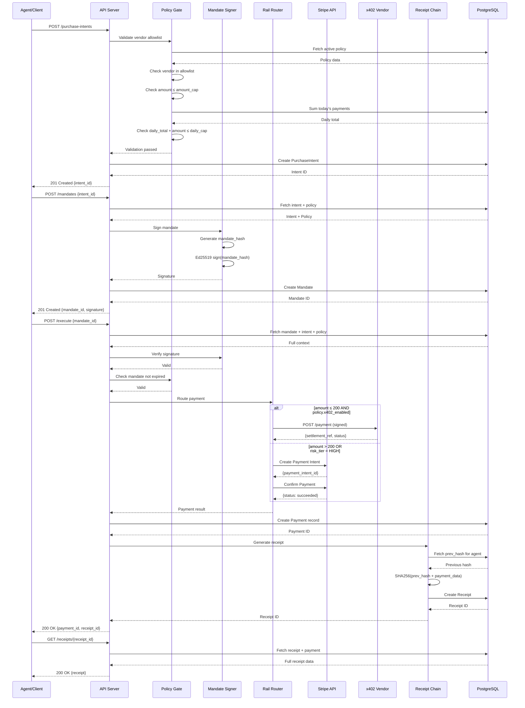
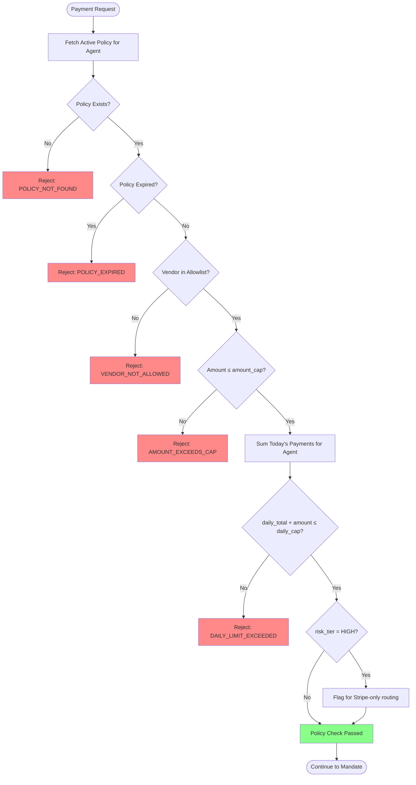
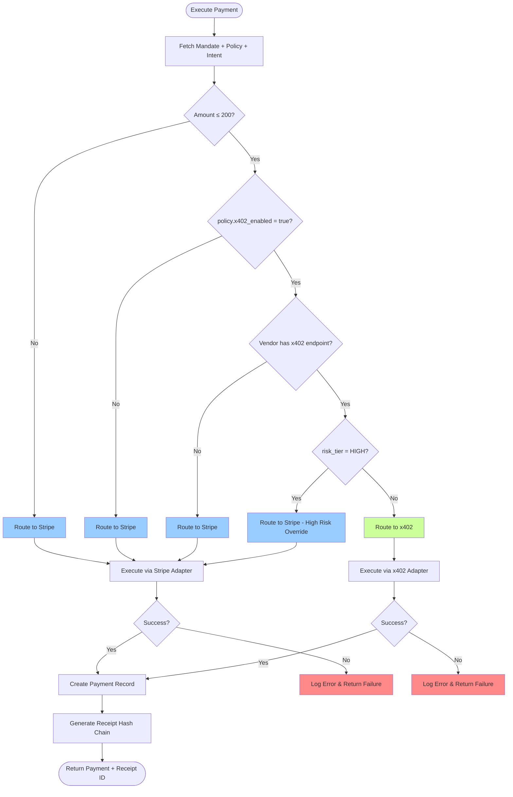
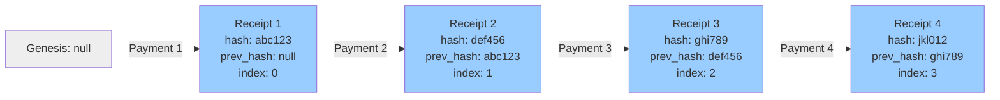
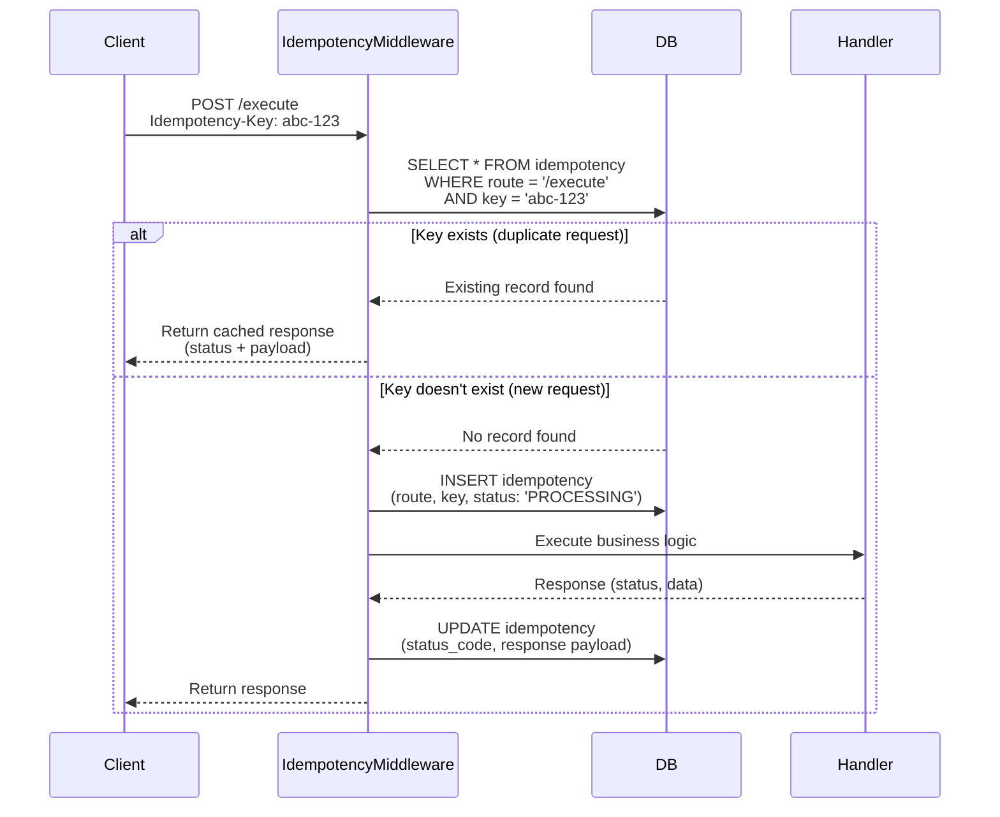

# AP2-Native Agent Payment Gateway - System Architecture

## Table of Contents

1. [Overview](#overview)
2. [Architecture Pattern](#architecture-pattern)
3. [Technology Stack](#technology-stack)
4. [System Components](#system-components)
5. [Data Flow Diagrams](#data-flow-diagrams)
6. [Payment Routing Heuristic](#payment-routing-heuristic)
7. [Security Architecture](#security-architecture)
8. [Scalability and Performance](#scalability-and-performance)
9. [Error Handling and Observability](#error-handling-and-observability)
10. [Deployment Architecture](#deployment-architecture)

---

## Overview

The **AP2-Native Agent Payment Gateway** is a policy-driven payment routing system that enables autonomous agents to make secure, auditable micropayments through multiple payment rails (Stripe and x402 protocol). The system enforces spending policies, generates cryptographic mandates, and maintains a tamper-proof receipt chain.

### Key Features

- **Multi-Rail Payment Routing** - Automatically routes payments to Stripe (test mode) or x402 based on amount and policy
- **Policy-First Enforcement** - All payments validated against vendor allowlists, amount caps, and daily limits
- **Cryptographic Mandates** - Ed25519-signed payment approvals with expiration
- **Receipt Hash Chain** - SHA256-based tamper-proof audit trail per agent
- **Idempotent Operations** - All mutations protected by database-backed idempotency
- **Test Mode Only** - No production payments; safe for development and testing

---

## Architecture Pattern

**Pattern:** Modular Monolith with Domain-Driven Design

The system uses a monolithic architecture organized into well-defined packages:

- **apps/api** - Express HTTP server with route handlers
- **packages/domain** - Shared types, schemas, and business logic
- **packages/database** - Prisma ORM and database client
- **packages/rails** - Payment provider adapters (Stripe, x402)
- **packages/receipts** - Hash chain utilities

This pattern provides:
- Simple deployment and operations
- Clear module boundaries
- Easy local development
- Future-ready for microservices extraction if needed

---

## Technology Stack

### Backend Framework

**Express 4.x** (Free, Open-Source)

**Rationale:**
- Battle-tested, stable HTTP framework
- Extensive middleware ecosystem
- Simple async/await support
- Large community and documentation
- No vendor lock-in

### Database

**PostgreSQL 14+ with Prisma 5.x**

**Rationale:**
- ACID compliance for financial transactions
- Rich indexing for performance
- JSON support for flexible metadata
- Prisma provides type-safe queries and migrations
- Free hosted options (Neon, Railway, Supabase)

### Programming Language

**TypeScript 5.x (Strict Mode)**

**Rationale:**
- Type safety prevents runtime errors
- Excellent IDE support
- Zod integration for runtime validation
- Industry standard for Node.js backends

### Validation

**Zod (Latest Stable)**

**Rationale:**
- Runtime type checking
- TypeScript type inference
- Composable schemas
- Clear error messages
- Zero dependencies

### Cryptography

**@noble/curves (Ed25519) and Node.js crypto (SHA256)**

**Rationale:**
- Noble is audited, lightweight, and well-maintained
- Ed25519 provides fast signatures with small keys
- Native crypto module for hashing (no dependencies)

### Payment Providers

**Stripe (Test Mode Only)**

**Rationale:**
- Industry-standard payment API
- Excellent documentation and SDKs
- Test mode requires no real accounts
- Webhook support for async events

**x402 Protocol (Custom)**

**Rationale:**
- Purpose-built for micropayments
- Fast synchronous settlement
- No transaction fees for testing
- Full control over implementation

---

## System Components



### Component Descriptions

#### API Layer (apps/api)

**Express Server** (`src/index.ts`, `src/app.ts`)
- HTTP server setup
- Middleware registration
- Route mounting
- Graceful shutdown handling

**Auth Middleware** (`src/middleware/auth.ts`)
- Agent authentication (JWT or API key)
- Request validation
- Context injection

**Idempotency Middleware** (`src/middleware/idempotency.ts`)
- Idempotency-Key header enforcement
- Duplicate request detection
- Response caching and replay

**Error Handler** (`src/middleware/error-handler.ts`)
- Global exception catching
- Error logging with redaction
- Standardized error responses

**Route Handlers** (`src/routes/`)
- `purchase-intents.ts` - Create payment intents
- `mandates.ts` - Issue signed mandates
- `execute.ts` - Execute payments
- `receipts.ts` - Retrieve receipt history
- `webhooks/stripe.ts` - Stripe webhook handler

#### Service Layer

**Policy Gate Service** (`src/services/policy-gate.ts`)
- Validate vendor against allowlist
- Check amount against per-transaction cap
- Check daily spending against daily cap
- Validate policy expiration
- Enforce risk tier restrictions

**Mandate Signer Service** (`src/services/mandate-signer.ts`)
- Generate mandate hash from intent + policy
- Sign mandate with Ed25519 private key
- Verify mandate signatures
- Check mandate expiration

**Rail Router Service** (`src/services/router.ts`)
- Implement routing heuristic (see diagram below)
- Select payment provider (Stripe or x402)
- Execute payment through selected adapter
- Handle provider-specific errors

**Receipt Chain Service** (`src/services/receipt-chain.ts`)
- Fetch previous receipt hash for agent
- Generate new receipt hash (prev_hash + payment_data)
- Validate chain integrity
- Detect broken chains

#### Adapter Layer (packages/rails)

**Stripe Adapter** (`src/stripe.ts`)
- Create Payment Intents
- Confirm payments with test cards
- Verify webhook signatures
- Handle Stripe errors

**x402 Adapter** (`src/x402.ts`)
- Generate canonical JSON
- Sign requests with Ed25519
- Send HTTP POST to vendor endpoint
- Parse settlement responses
- Handle timeouts (5 seconds)

#### Data Layer (packages/database)

**Prisma Client** (`src/client.ts`)
- Type-safe database queries
- Transaction management
- Connection pooling
- Query logging

#### Domain Layer (packages/domain)

**Zod Schemas** (`src/types.ts`)
- Runtime validation for all inputs
- TypeScript type generation
- Reusable across layers

**API Contracts** (`src/api-contracts.ts`)
- Standardized response formats
- Error code definitions
- HTTP status mapping

---

## Data Flow Diagrams

### Primary Payment Flow



### Policy Gate Decision Tree



### Payment Routing Heuristic



**Routing Decision Logic:**

1. **Check Amount**: If amount > 200, route to Stripe (x402 max is 200)
2. **Check Policy x402 Flag**: If `policy.x402_enabled = false`, route to Stripe
3. **Check Vendor Support**: If vendor doesn't have x402 endpoint configured, route to Stripe
4. **Check Risk Tier**: If `agent.risk_tier = HIGH`, route to Stripe (requires 3DS, fraud detection)
5. **Default to x402**: If all checks pass, use x402 for fast, low-cost processing

### Receipt Hash Chain



**Hash Calculation:**

```typescript
function generateReceiptHash(
  prevHash: string | null,
  paymentData: {
    payment_id: string;
    mandate_id: string;
    amount: number;
    currency: string;
    timestamp: Date;
  }
): string {
  const canonicalData = JSON.stringify(
    {
      prev_hash: prevHash,
      payment_id: paymentData.payment_id,
      mandate_id: paymentData.mandate_id,
      amount: paymentData.amount,
      currency: paymentData.currency,
      timestamp: paymentData.timestamp.toISOString(),
    },
    Object.keys(paymentData).sort()
  );

  const hash = crypto.createHash("sha256").update(canonicalData).digest("hex");
  return `sha256:${hash}`;
}
```

**Chain Verification:**

Nightly job re-computes all hashes for each agent and compares to stored hashes. Any mismatch triggers an alert.

### Idempotency Flow



**Idempotency Table Schema:**

- `route` - API endpoint path (e.g., `/execute`)
- `key` - Client-provided idempotency key
- `payload` - Original request body (for auditing)
- `status_code` - HTTP status code of response
- `response` - Cached response body
- `created_at` - Timestamp (TTL: 24 hours)

**UNIQUE constraint:** `(route, key)`

---

## Security Architecture

### Authentication and Authorization

**Authentication Methods:**

1. **JWT Tokens** (for human users/admins)
   - Issued by login endpoint
   - 7-day expiration
   - Stored in HTTP-only cookies or Authorization header

2. **API Keys** (for agents)
   - SHA256-hashed in database
   - Passed in `X-API-Key` header
   - Rate-limited per key

**Authorization:**

- **Role-Based Access Control (RBAC)**
  - `agent` - Can create intents, mandates, and execute payments
  - `admin` - Can manage agents, policies, and view all receipts

### Data Protection

**Encryption:**

- **At Rest**: PostgreSQL supports transparent data encryption (TDE) on managed platforms
- **In Transit**: HTTPS/TLS 1.3 required for all communications

**Hashing:**

- Passwords: bcrypt with salt (cost factor 12)
- API Keys: SHA256 with per-key salt
- Mandate Signatures: Ed25519 (cryptographically secure)

**Secrets Management:**

- All secrets loaded from environment variables (validated by Zod)
- No secrets in code, logs, or error messages
- Use Railway/Neon secret management in production

### Input Validation and Security Measures

1. **Input Validation**: Zod schemas reject malformed requests before reaching business logic
2. **SQL Injection Prevention**: Prisma uses parameterized queries (immune to SQLi)
3. **XSS Prevention**: No HTML rendering; JSON-only API
4. **CSRF Protection**: Stateless API (no cookies for state); idempotency keys prevent duplicate submissions
5. **Rate Limiting**: 100 requests per 15 minutes per IP (using express-rate-limit)
6. **Security Headers**: Helmet.js for Content-Security-Policy, X-Frame-Options, etc.
7. **Webhook Verification**: Stripe signatures verified; x402 signatures verified
8. **Sensitive Data Redaction**: Logs strip API keys, signatures, and payment details

### Threat Model

| Threat                  | Mitigation                                    |
|-------------------------|-----------------------------------------------|
| Replay attacks          | Idempotency keys + timestamp validation      |
| Signature forgery       | Ed25519 verification                         |
| Policy bypass           | Centralized policy gate service              |
| Receipt tampering       | Hash chain verification                      |
| Excessive spending      | Daily caps + per-transaction caps            |
| Stolen API keys         | Rate limiting + key rotation                 |
| Man-in-the-middle       | HTTPS/TLS enforcement                        |
| SQL injection           | Prisma parameterized queries                 |

---

## Scalability and Performance

### Horizontal Scaling

**Load Balancing:**

- Deploy multiple API instances behind a load balancer (Railway auto-scaling or AWS ALB)
- Stateless design (no in-memory sessions)
- Database connection pooling (Prisma default pool size: 10)

### Database Scaling

**Read Replicas:**

- PostgreSQL read replicas for GET endpoints (receipts, policies)
- Write operations go to primary database
- Prisma supports read replicas via connection URLs

**Indexing Strategy:**

Key indexes (already in schema):

- `agents(status)` - Fast agent lookups
- `policies(agent_id, expires_at)` - Policy validation queries
- `purchase_intents(agent_id, created_at)` - Intent history
- `receipts(agent_id, chain_index)` - Chain traversal
- `idempotency(route, key)` - Duplicate detection

### Caching Strategy

**Redis for:**

- Active policies (TTL: 5 minutes)
- Daily spending totals (TTL: 1 hour, invalidate on new payment)
- Idempotency responses (TTL: 24 hours)

**Implementation:**

Use `ioredis` library with fallback to database if cache miss.

### Performance Targets

| Metric                    | Target              |
|---------------------------|---------------------|
| API response time (p95)   | < 200ms             |
| Database query time (p95) | < 50ms              |
| x402 payment timeout      | 5 seconds (enforced)|
| Stripe payment time       | < 3 seconds         |
| Concurrent users          | 1,000+              |
| Throughput                | 100 req/s per instance |

---

## Error Handling and Observability

### Logging

**Structured Logging with Pino:**

```typescript
{
  "level": "info",
  "time": "2025-10-12T14:30:00.000Z",
  "req_id": "req_abc123",
  "agent_id": "agt_xyz",
  "route": "/execute",
  "status_code": 200,
  "duration_ms": 145,
  "msg": "Payment executed successfully"
}
```

**Log Levels:**

- `fatal` - System crashes
- `error` - Failed operations (log + alert)
- `warn` - Policy violations, retries
- `info` - Successful operations
- `debug` - Detailed execution flow
- `trace` - Database queries, external API calls

**Redaction:**

- API keys masked: `sk_test_***abc123`
- Signatures stripped from logs
- Payment amounts logged but not card details

### Monitoring and Alerting

**Metrics to Track:**

- Request rate (per endpoint)
- Error rate (by error code)
- Payment success rate (by provider)
- Daily spending per agent
- Database connection pool usage
- Receipt chain integrity

**Tools:**

- **Prometheus + Grafana** - Metrics dashboards
- **Sentry** - Error tracking and alerting
- **Loki** - Log aggregation
- **PagerDuty** - On-call alerts for critical errors

**Alerts:**

- Error rate > 5% for 5 minutes
- Payment failure rate > 10%
- Database connection pool exhausted
- Receipt chain broken (daily verification job)

### Error Response Format

```json
{
  "success": false,
  "error": {
    "code": "POLICY_VIOLATION",
    "message": "Amount exceeds transaction cap",
    "details": {
      "amount": 500,
      "cap": 200,
      "policy_id": "pol_abc123"
    }
  }
}
```

---

## Deployment Architecture

### Environments

1. **Development** - Local Docker Compose
2. **Staging** - Railway with Neon Postgres
3. **Production** - Railway with production-grade Neon Postgres

### Hosting

**Frontend (if built):** Vercel
**Backend API:** Railway (Docker containers)
**Database:** Neon (serverless Postgres) or Railway Postgres

### Domain Setup

- API: `https://api.ap2-gateway.com`
- Admin (future): `https://admin.ap2-gateway.com`

### CI/CD Pipeline (GitHub Actions)

```yaml
name: Deploy API

on:
  push:
    branches: [main]

jobs:
  test:
    runs-on: ubuntu-latest
    steps:
      - uses: actions/checkout@v4
      - uses: actions/setup-node@v4
        with:
          node-version: 20
      - run: npm install
      - run: npm run test
      - run: npm run typecheck

  deploy:
    needs: test
    runs-on: ubuntu-latest
    steps:
      - uses: actions/checkout@v4
      - name: Deploy to Railway
        run: railway up --service api
        env:
          RAILWAY_TOKEN: ${{ secrets.RAILWAY_TOKEN }}
```

### Docker Configuration

**Dockerfile:**

```dockerfile
FROM node:20-alpine AS builder
WORKDIR /app
COPY package*.json ./
RUN npm ci
COPY . .
RUN npm run build

FROM node:20-alpine
WORKDIR /app
COPY --from=builder /app/dist ./dist
COPY --from=builder /app/node_modules ./node_modules
COPY package.json ./
ENV NODE_ENV=production
EXPOSE 3000
CMD ["node", "dist/index.js"]
```

### Health Checks

**Endpoint:** `GET /healthz`

**Response:**

```json
{
  "status": "healthy",
  "version": "1.0.0",
  "database": "connected",
  "uptime": 123456
}
```

---

## Design Decisions and Trade-offs

### Why Express over Fastify/Hono?

- **Familiarity**: Larger community, more resources
- **Stability**: Battle-tested in production
- **Middleware**: Extensive ecosystem (Helmet, CORS, rate-limit)
- **Trade-off**: Slightly slower than Fastify, but performance is sufficient for our use case

### Why Monolith over Microservices?

- **Simplicity**: Easier to develop, test, and deploy
- **Performance**: No network overhead between services
- **Transactions**: Database transactions across modules
- **Trade-off**: Harder to scale individual components, but premature optimization is not needed

### Why Prisma over Raw SQL/Kysely?

- **Type Safety**: Auto-generated types from schema
- **Migrations**: Built-in migration tool
- **Productivity**: Less boilerplate than raw SQL
- **Trade-off**: Slightly less control over query optimization, but Prisma generates efficient SQL

### Why Ed25519 over RSA?

- **Performance**: 10x faster signature verification
- **Key Size**: 32-byte keys vs 2048-bit RSA keys
- **Security**: Modern, quantum-resistant (theoretically)
- **Trade-off**: Less widespread than RSA, but sufficient for our use case

---

## Next Steps (Implementation Roadmap)

1. **Phase 1: Foundation** (Week 1)
   - Set up project structure
   - Implement database schema and migrations
   - Create domain types and validation

2. **Phase 2: Core Services** (Week 2)
   - Policy gate service with tests
   - Mandate signer service with tests
   - Receipt chain service with tests

3. **Phase 3: API Endpoints** (Week 3)
   - Purchase intents endpoint
   - Mandates endpoint
   - Execute endpoint
   - Receipts endpoint

4. **Phase 4: Payment Rails** (Week 4)
   - Stripe adapter implementation
   - x402 adapter implementation
   - Rail router with heuristic

5. **Phase 5: Testing and Docs** (Week 5)
   - Integration tests (E2E flow)
   - OpenAPI documentation
   - Demo scripts and examples

6. **Phase 6: Deployment** (Week 6)
   - Dockerization
   - Railway deployment
   - Monitoring setup

---

**Document Version:** 1.0
**Last Updated:** 2025-10-12
**Maintainer:** AP2 Development Team
