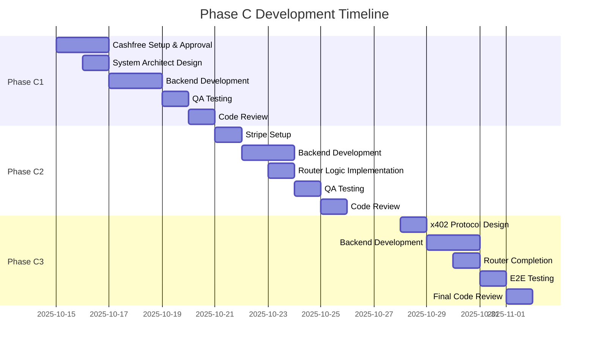

# Phase C Development Plan - Payment Rails Integration
## AP2-Native Agent Payment Gateway

**Document Version:** 1.0
**Created:** October 15, 2025
**Status:** READY TO START
**Project Manager:** Claude Code AI
**Estimated Duration:** 3 weeks (15 working days)

---

## Table of Contents

1. [Executive Summary](#executive-summary)
2. [Phase Overview](#phase-overview)
3. [Phase C1: Cashfree Integration](#phase-c1-cashfree-integration-week-1)
4. [Phase C2: Dual-Rail Architecture](#phase-c2-dual-rail-architecture-week-2)
5. [Phase C3: x402 Protocol](#phase-c3-x402-protocol-week-3)
6. [Agent Handoff Specifications](#agent-handoff-specifications)
7. [Success Criteria & Acceptance Testing](#success-criteria--acceptance-testing)
8. [Risk Management](#risk-management)

---

## Executive Summary

### Current State (Phase B2 Complete ✅)
- All 9 REST API endpoints operational
- Policy enforcement working (vendor allowlist, caps, daily limits)
- Ed25519 mandate signing functional
- SHA256 hash chain receipt system operational
- Mock payment provider in place
- Database schema deployed and tested

### What's Missing
- **Real payment processing** - Currently using mock provider
- **Payment rail adapters** - Need Cashfree, Stripe, x402 implementations
- **Webhook handlers** - Payment status updates from providers
- **Routing logic** - Intelligent selection of payment rails
- **End-to-end validation** - Real money flow (test mode)

### Phase C Goals
1. **Week 1:** Replace mock provider with **Cashfree** (primary rail)
2. **Week 2:** Add **Stripe** as secondary rail + failover logic
3. **Week 3:** Implement **x402 protocol** for micropayments
4. **Outcome:** Production-ready, multi-rail payment gateway

---

## Phase Overview



---

## Phase C1: Cashfree Integration (Week 1)

### Duration: 5 working days
### Goal: Replace mock provider with working Cashfree payment processing

---

### Day 1-2: Setup & Approval (Human + DevOps)

#### **BLOCKER: Cashfree S2S Flag Approval**

**Status:** ⏳ WAITING FOR CASHFREE SUPPORT

**Action Required (Human Task):**
```
To: care@cashfree.com
Subject: Enable S2S and PCI DSS flags for sandbox account TEST430329ae80e0f32e41a393d78b923034

Body:
Hi Cashfree Team,

I'm integrating Cashfree Payment Gateway for an agent-based payment routing system.
Please enable the following flags for my sandbox account:

✅ S2S (Server-to-Server) flag
✅ PCI DSS flag (for card payments)

Account Details:
- App ID: TEST430329ae80e0f32e41a393d78b923034
- Environment: Sandbox
- Use Case: Payment gateway for autonomous agent micropayments

Please confirm when enabled.

Thank you!
```

**Expected Response Time:** 1-2 business days

**Parallel Work (While Waiting):**
- ✅ Credentials already added to `.env` and `.env.template`
- Test API connectivity with basic GET request
- System Architect: Design Cashfree adapter architecture

---

#### **Handoff #1: DevOps Engineer**

**Agent:** `devops-engineer`

**Task:** Test Cashfree API Connectivity

**Input Artifacts:**
- `.env` file with Cashfree credentials
- API endpoint: `https://sandbox.cashfree.com/pg`

**Deliverables:**
1. cURL test script that validates credentials work
2. Document any connectivity issues
3. Confirm S2S flag status (enabled/disabled)

**Acceptance Criteria:**
- [ ] cURL request returns 200 or 403 (403 expected if S2S not enabled)
- [ ] Credentials authenticate successfully
- [ ] Network connectivity confirmed

**Command to Execute:**
```bash
curl -X GET "https://sandbox.cashfree.com/pg/orders" \
  -H "x-client-id: TEST430329ae80e0f32e41a393d78b923034" \
  -H "x-client-secret: TESTaf195616268bd6202eeb3bf8dc458956e7192a85" \
  -H "x-api-version: 2025-01-01"
```

---

### Day 2: Architecture & Design

#### **Handoff #2: System Architect**

**Agent:** `system-architect`

**Task:** Design Cashfree Adapter Architecture

**Context:**
- Existing `RailAdapter` interface in `packages/rails/src/interface.ts`
- Current `StripeAdapter` implementation as reference
- Cashfree uses 2-step flow: Create Order → Get Session ID

**Key Differences to Address:**

| Aspect | Stripe (Current) | Cashfree (Target) |
|--------|------------------|-------------------|
| Amount Format | Minor units (250) | Major units ("2.50") |
| Currency | Lowercase ("inr") | Uppercase ("INR") |
| Auth | Single Bearer token | Two headers (x-client-id, x-client-secret) |
| Payment Flow | 1-step (create + confirm) | 2-step (order → session) |

**Deliverables:**
1. Updated `RailAdapter` interface (add "cashfree" to union type)
2. `CashfreeAdapter` class specification
3. Amount conversion utility function design
4. Error mapping table (Cashfree error codes → Gateway error codes)
5. Webhook payload specification

**Acceptance Criteria:**
- [ ] Interface supports all 3 rails: "stripe" | "cashfree" | "x402"
- [ ] Amount conversion formula documented
- [ ] API call sequence diagram provided
- [ ] Error handling strategy defined

**Output Format:** Technical design document (markdown)

---

### Day 3-4: Implementation

#### **Handoff #3: Backend Developer**

**Agent:** `backend-developer`

**Task:** Implement CashfreeAdapter

**Input Artifacts:**
1. System Architect's design document
2. Existing `packages/rails/src/stripe.ts` as reference
3. Cashfree API documentation: https://docs.cashfree.com/reference/pg-new-apis-endpoint

**Files to Create/Modify:**

**1. Update Interface**
- **File:** `packages/rails/src/interface.ts`
- **Change:** Add "cashfree" to RailAdapter.name union type

**2. Update Environment Schema**
- **File:** `packages/domain/src/env.ts`
- **Changes:**
  ```typescript
  // Make Stripe optional (for now)
  STRIPE_SECRET_KEY: z.string().optional(),
  STRIPE_WEBHOOK_SECRET: z.string().optional(),

  // Add Cashfree (required)
  CASHFREE_APP_ID: z.string().startsWith("TEST"),
  CASHFREE_SECRET_KEY: z.string().startsWith("TEST"),
  CASHFREE_ENV: z.enum(["sandbox", "production"]),
  CASHFREE_API_VERSION: z.string(),
  CASHFREE_API_URL: z.string().url(),
  ```

**3. Create CashfreeAdapter**
- **File:** `packages/rails/src/cashfree.ts` (NEW)
- **Class:** `CashfreeAdapter implements RailAdapter`
- **Methods:**
  - `constructor()` - Load env variables
  - `executePayment(request: PaymentRequest): Promise<PaymentResult>`
  - `verifyWebhook(payload: unknown, signature: string): boolean`
  - `private convertAmount(minorUnits: number): string` - Convert 250 → "2.50"
  - `private createOrder(...)` - POST /orders
  - `private getOrderStatus(orderId: string)` - GET /orders/{id}

**4. Update Router**
- **File:** `packages/rails/src/router.ts`
- **Change:** Replace mock provider with CashfreeAdapter
- **Logic:** All payments → Cashfree (for Phase C1)

**5. Create Webhook Handler**
- **File:** `apps/api/src/routes/webhooks/cashfree.ts` (NEW)
- **Endpoint:** `POST /webhooks/cashfree`
- **Logic:**
  1. Verify webhook signature
  2. Extract order_id and order_status
  3. Update Payment record in database
  4. Return 200 OK

**6. Register Webhook Route**
- **File:** `apps/api/src/app.ts`
- **Change:** Mount `/webhooks/cashfree` route

**Implementation Requirements:**
- Use `fetch()` for HTTP requests (native Node.js 20)
- Implement exponential backoff for retries (max 3 attempts)
- Log all API requests/responses (redacted)
- Handle all Cashfree error codes gracefully
- Return standardized `PaymentResult` format

**Acceptance Criteria:**
- [ ] Code compiles without TypeScript errors
- [ ] All methods properly typed
- [ ] Error handling covers network + API errors
- [ ] Logging includes request IDs for tracing
- [ ] Webhook signature verification implemented
- [ ] Amount conversion tested (unit test)

**Time Estimate:** 8-10 hours

---

#### **Handoff #4: Backend Developer (Unit Tests)**

**Agent:** `backend-developer`

**Task:** Write Unit Tests for CashfreeAdapter

**Files to Create:**
- `packages/rails/src/cashfree.test.ts` (NEW)

**Test Cases Required:**

**Amount Conversion Tests:**
1. ✅ Converts 250 minor units → "2.50"
2. ✅ Converts 100000 minor units → "1000.00"
3. ✅ Handles zero amount → "0.00"
4. ✅ Preserves 2 decimal places

**Payment Execution Tests:**
5. ✅ Success: Order created, returns payment_session_id
6. ✅ Failure: Network error handled gracefully
7. ✅ Failure: Cashfree API error (invalid amount)
8. ✅ Failure: Authentication failure (401)
9. ✅ Currency conversion: "inr" → "INR"

**Webhook Verification Tests:**
10. ✅ Valid signature → returns true
11. ✅ Invalid signature → returns false
12. ✅ Missing signature → returns false

**Mocking Strategy:**
- Mock `fetch()` for API calls
- Use `vi.fn()` for Cashfree responses
- Test both success and error paths

**Acceptance Criteria:**
- [ ] All 12 test cases pass
- [ ] Code coverage ≥ 90% for CashfreeAdapter
- [ ] Tests run in <5 seconds

**Time Estimate:** 3-4 hours

---

### Day 5: Testing & Validation

#### **Handoff #5: QA Tester**

**Agent:** `qa-tester`

**Task:** Integration Testing - End-to-End Payment Flow

**Pre-requisites:**
- ✅ Cashfree S2S flag enabled by support
- ✅ Backend code deployed to local dev environment
- ✅ Database seeded with test agent + policy

**Test Plan:**

**Test Suite 1: Happy Path**
1. Create Purchase Intent (amount: 25000 INR = ₹250)
2. Create Mandate (vendor: acme-corp, within caps)
3. Execute Payment (should hit Cashfree API)
4. Verify Payment record created with Cashfree order_id
5. Verify Receipt hash chain integrity
6. Check Cashfree dashboard for order

**Test Suite 2: Policy Enforcement**
7. Attempt payment with unauthorized vendor → Expect 422
8. Attempt payment exceeding amount cap → Expect 422
9. Attempt payment exceeding daily cap → Expect 422

**Test Suite 3: Error Handling**
10. Invalid currency (USD instead of INR) → Expect graceful error
11. Cashfree API timeout → Expect 500 with retry
12. Duplicate idempotency key → Expect cached response

**Test Suite 4: Webhook Processing**
13. Send mock webhook (order.paid) → Verify payment status updated
14. Send invalid signature → Expect 401
15. Send duplicate webhook → Expect idempotent behavior

**Deliverables:**
1. Test execution report (pass/fail for each case)
2. Screenshots of Cashfree dashboard showing orders
3. Database snapshots showing Payment + Receipt records
4. List of bugs found (if any)

**Acceptance Criteria:**
- [ ] All 15 test cases documented
- [ ] ≥ 13/15 tests passing (87% pass rate minimum)
- [ ] Critical path (happy path) 100% passing
- [ ] All bugs logged in GitHub Issues

**Time Estimate:** 4-6 hours

---

#### **Handoff #6: Code Reviewer**

**Agent:** `code-reviewer`

**Task:** Code Review - Phase C1 Implementation

**Files to Review:**
1. `packages/domain/src/env.ts`
2. `packages/rails/src/interface.ts`
3. `packages/rails/src/cashfree.ts`
4. `packages/rails/src/cashfree.test.ts`
5. `packages/rails/src/router.ts`
6. `apps/api/src/routes/webhooks/cashfree.ts`

**Review Checklist:**

**Security:**
- [ ] No hardcoded credentials in code
- [ ] Webhook signatures verified before processing
- [ ] API keys loaded from environment only
- [ ] Sensitive data redacted in logs

**Code Quality:**
- [ ] TypeScript strict mode compliance
- [ ] All functions properly typed (no `any`)
- [ ] Error handling comprehensive
- [ ] Logging structured (pino format)

**Architecture:**
- [ ] Follows RailAdapter interface contract
- [ ] Separation of concerns maintained
- [ ] No business logic in webhook handler (delegates to service)
- [ ] Amount conversion centralized

**Testing:**
- [ ] Unit test coverage ≥ 90%
- [ ] All edge cases covered
- [ ] Mock strategy appropriate

**Documentation:**
- [ ] JSDoc comments for public methods
- [ ] README updated with Cashfree setup
- [ ] Error codes documented

**Deliverables:**
1. Code review report (markdown)
2. List of required changes (blocking issues)
3. List of suggestions (non-blocking)
4. Approval/rejection decision

**Acceptance Criteria:**
- [ ] Zero blocking issues
- [ ] All security checks passed
- [ ] Code approved for merge

**Time Estimate:** 2-3 hours

---

### Phase C1 Completion Checklist

- [ ] Cashfree S2S flag enabled (human task)
- [ ] API connectivity tested (DevOps)
- [ ] Architecture designed (System Architect)
- [ ] CashfreeAdapter implemented (Backend Dev)
- [ ] Unit tests written and passing (Backend Dev)
- [ ] Integration tests passing (QA Tester)
- [ ] Code reviewed and approved (Code Reviewer)
- [ ] Documentation updated
- [ ] Demo video recorded (optional)

**Exit Criteria:**
- ✅ Real payment completes via Cashfree sandbox
- ✅ Receipt hash chain maintained
- ✅ All tests passing
- ✅ Code merged to `main` branch

---

## Phase C2: Dual-Rail Architecture (Week 2)

### Duration: 5 working days
### Goal: Add Stripe as secondary rail + implement intelligent routing

---

### Day 6: Stripe Setup

#### **Handoff #7: Human Task + DevOps**

**Task:** Obtain Stripe Test API Keys

**Action Required (Human):**
1. Sign up at https://dashboard.stripe.com/
2. Navigate to Developers → API Keys
3. Copy **Test Secret Key** (starts with `sk_test_`)
4. Navigate to Webhooks → Add endpoint
5. Copy **Webhook Secret** (starts with `whsec_`)

**DevOps Task:**
1. Add keys to `.env`:
   ```bash
   STRIPE_SECRET_KEY=sk_test_[YOUR_KEY]
   STRIPE_WEBHOOK_SECRET=whsec_[YOUR_SECRET]
   ```
2. Test connectivity:
   ```bash
   curl https://api.stripe.com/v1/payment_intents \
     -u "sk_test_[YOUR_KEY]:" \
     -d "amount=2000" \
     -d "currency=usd"
   ```

**Acceptance Criteria:**
- [ ] Stripe test keys obtained
- [ ] Keys added to `.env`
- [ ] API connectivity confirmed

---

### Day 7-8: Implementation

#### **Handoff #8: Backend Developer**

**Agent:** `backend-developer`

**Task:** Integrate StripeAdapter + Implement Dual-Rail Routing

**Files to Modify:**

**1. Update Environment Schema**
- **File:** `packages/domain/src/env.ts`
- **Change:** Make Stripe keys required (not optional)
  ```typescript
  STRIPE_SECRET_KEY: z.string().startsWith("sk_test_"),
  STRIPE_WEBHOOK_SECRET: z.string().startsWith("whsec_"),
  ```

**2. Update StripeAdapter (if needed)**
- **File:** `packages/rails/src/stripe.ts`
- **Review:** Ensure follows same interface as CashfreeAdapter
- **Fix:** Any bugs discovered during Phase C1

**3. Implement Dual-Rail Router**
- **File:** `packages/rails/src/router.ts`
- **Logic:**
  ```typescript
  async route(request: PaymentRequest): Promise<PaymentResult> {
    // Strategy 1: Currency-based routing
    if (request.currency === "INR") {
      try {
        return await this.cashfree.executePayment(request);
      } catch (error) {
        // Fallback to Stripe on Cashfree failure
        console.warn("Cashfree failed, falling back to Stripe", error);
        return await this.stripe.executePayment(request);
      }
    }

    // Strategy 2: Non-INR currencies → Stripe
    return await this.stripe.executePayment(request);
  }
  ```

**4. Create Stripe Webhook Handler**
- **File:** `apps/api/src/routes/webhooks/stripe.ts` (NEW)
- **Endpoint:** `POST /webhooks/stripe`
- **Events:** `payment_intent.succeeded`, `payment_intent.payment_failed`

**5. Update Router Service**
- **File:** `apps/api/src/services/router.ts`
- **Add:** Routing metrics (track which rail used)

**Implementation Requirements:**
- Instantiate both adapters in router constructor
- Implement graceful failover (try primary, fallback to secondary)
- Log routing decision (which rail selected + reason)
- Track metrics: payment_rail_selected{rail="cashfree|stripe"}

**Acceptance Criteria:**
- [ ] Router initializes both adapters
- [ ] Currency-based routing works (INR → Cashfree, others → Stripe)
- [ ] Failover works (Cashfree down → Stripe succeeds)
- [ ] Metrics logged for each routing decision
- [ ] Stripe webhook handler processes events

**Time Estimate:** 6-8 hours

---

#### **Handoff #9: Backend Developer (Tests)**

**Agent:** `backend-developer`

**Task:** Write Integration Tests for Dual-Rail Router

**Files to Create:**
- `packages/rails/src/router.test.ts` (NEW)

**Test Cases:**

**Routing Logic Tests:**
1. ✅ INR payment → routes to Cashfree
2. ✅ USD payment → routes to Stripe
3. ✅ EUR payment → routes to Stripe
4. ✅ Cashfree failure → falls back to Stripe
5. ✅ Both rails down → returns error

**Webhook Tests:**
6. ✅ Stripe webhook (payment_intent.succeeded) → updates payment
7. ✅ Cashfree webhook (order.paid) → updates payment
8. ✅ Invalid Stripe signature → rejected
9. ✅ Invalid Cashfree signature → rejected

**Acceptance Criteria:**
- [ ] All 9 tests pass
- [ ] Failover logic tested with mocked failures
- [ ] Webhook handlers tested end-to-end

**Time Estimate:** 4 hours

---

### Day 9: Testing

#### **Handoff #10: QA Tester**

**Agent:** `qa-tester`

**Task:** Test Dual-Rail Routing + Failover

**Test Scenarios:**

**Scenario 1: INR Payment (Cashfree)**
- Create intent with currency: "INR"
- Execute payment
- **Verify:** Cashfree order created (check dashboard)
- **Verify:** Receipt contains Cashfree order_id

**Scenario 2: USD Payment (Stripe)**
- Create intent with currency: "USD"
- Execute payment
- **Verify:** Stripe payment intent created (check dashboard)
- **Verify:** Receipt contains Stripe payment_intent_id

**Scenario 3: Failover (Cashfree → Stripe)**
- Temporarily break Cashfree credentials (wrong secret key)
- Create intent with currency: "INR"
- Execute payment
- **Verify:** Payment fails on Cashfree, retries with Stripe
- **Verify:** Receipt contains Stripe payment_intent_id
- **Verify:** Logs show failover event

**Scenario 4: Webhook Processing**
- Trigger Stripe webhook (use Stripe CLI)
- **Verify:** Payment status updated in database
- Trigger Cashfree webhook (manual POST)
- **Verify:** Payment status updated in database

**Deliverables:**
1. Test execution report
2. Screenshots from both Cashfree + Stripe dashboards
3. Database snapshots showing payments from both rails
4. Logs showing routing decisions

**Acceptance Criteria:**
- [ ] All 4 scenarios pass
- [ ] Failover confirmed working
- [ ] Both rails process payments successfully

**Time Estimate:** 4 hours

---

### Day 10: Review

#### **Handoff #11: Code Reviewer**

**Agent:** `code-reviewer`

**Task:** Review Phase C2 Implementation

**Files to Review:**
1. `packages/rails/src/router.ts`
2. `packages/rails/src/router.test.ts`
3. `apps/api/src/routes/webhooks/stripe.ts`
4. `packages/domain/src/env.ts` (updated)

**Review Focus:**
- Failover logic correctness
- Error handling during provider failures
- Metrics tracking implementation
- Webhook security (signature verification)

**Acceptance Criteria:**
- [ ] Failover logic sound (no infinite loops)
- [ ] Error handling prevents cascading failures
- [ ] Code approved for merge

**Time Estimate:** 2 hours

---

### Phase C2 Completion Checklist

- [ ] Stripe API keys obtained (human task)
- [ ] StripeAdapter integrated (Backend Dev)
- [ ] Dual-rail router implemented (Backend Dev)
- [ ] Failover logic tested (QA Tester)
- [ ] Webhook handlers for both rails working (QA Tester)
- [ ] Code reviewed and approved (Code Reviewer)

**Exit Criteria:**
- ✅ Payments process through both Cashfree and Stripe
- ✅ Automatic failover working
- ✅ Webhooks updating payment status
- ✅ All tests passing

---

## Phase C3: x402 Protocol (Week 3)

### Duration: 5 working days
### Goal: Implement x402 micropayment protocol + complete 3-rail router

---

### Day 11: Design

#### **Handoff #12: System Architect**

**Agent:** `system-architect`

**Task:** Design x402 Adapter Architecture

**Context:**
- x402 is a custom micropayment protocol (HTTP-based)
- Used for amounts ≤ 200 minor units (₹2.00)
- Requires Ed25519 signed requests
- Synchronous settlement (no webhooks needed)

**Reference Document:** `docs/x402-protocol.md`

**Design Requirements:**
1. Request signing with Ed25519 (same key as mandates)
2. Canonical JSON formatting (deterministic)
3. Timeout handling (max 5 seconds)
4. Settlement verification
5. Error mapping (x402 → Gateway errors)

**Deliverables:**
1. x402 adapter class specification
2. Request/response format definition
3. Signature generation algorithm
4. Error handling strategy
5. Timeout + retry logic design

**Acceptance Criteria:**
- [ ] Request format matches x402 spec
- [ ] Signature algorithm documented
- [ ] Timeout strategy defined
- [ ] Error codes mapped

**Time Estimate:** 3 hours

---

### Day 12-13: Implementation

#### **Handoff #13: Backend Developer**

**Agent:** `backend-developer`

**Task:** Implement x402Adapter

**Input:** System Architect's design document

**Files to Create:**

**1. Create x402Adapter**
- **File:** `packages/rails/src/x402.ts`
- **Class:** `X402Adapter implements RailAdapter`
- **Methods:**
  - `executePayment(request: PaymentRequest): Promise<PaymentResult>`
  - `private signRequest(payload: object): string` - Ed25519 signing
  - `private canonicalJSON(obj: object): string` - Deterministic JSON
  - `private sendPayment(vendor: string, payload: object): Promise<any>` - HTTP POST

**2. Update Router with x402 Logic**
- **File:** `packages/rails/src/router.ts`
- **Logic:**
  ```typescript
  async route(request: PaymentRequest): Promise<PaymentResult> {
    // Micropayments (≤ 200) → x402 (if enabled)
    if (request.amount <= 200 && policy.x402_enabled) {
      return await this.x402.executePayment(request);
    }

    // INR → Cashfree (with Stripe fallback)
    if (request.currency === "INR") {
      try {
        return await this.cashfree.executePayment(request);
      } catch (error) {
        return await this.stripe.executePayment(request);
      }
    }

    // Others → Stripe
    return await this.stripe.executePayment(request);
  }
  ```

**3. Update Environment Schema**
- **File:** `packages/domain/src/env.ts`
- **Add:**
  ```typescript
  X402_TIMEOUT_MS: z.number().default(5000),
  X402_MAX_AMOUNT: z.number().default(200),
  ```

**Implementation Requirements:**
- Use `@noble/curves/ed25519` for signing
- Implement 5-second timeout (abort controller)
- Canonical JSON: sort keys alphabetically
- Log all x402 requests/responses
- Handle settlement_ref in response

**Acceptance Criteria:**
- [ ] x402 adapter compiles
- [ ] Signature generation working
- [ ] Timeout enforced (5s max)
- [ ] Returns standardized PaymentResult

**Time Estimate:** 6-8 hours

---

#### **Handoff #14: Backend Developer (Tests)**

**Agent:** `backend-developer`

**Task:** Write Unit Tests for x402Adapter

**Files to Create:**
- `packages/rails/src/x402.test.ts` (NEW)

**Test Cases:**

**Signature Tests:**
1. ✅ Generates valid Ed25519 signature
2. ✅ Canonical JSON produces deterministic output
3. ✅ Same input → same signature (idempotent)

**Payment Tests:**
4. ✅ Success: Returns settlement_ref
5. ✅ Timeout: Aborts after 5 seconds
6. ✅ Network error: Returns failure status
7. ✅ Vendor error (400): Returns failure with message

**Router Tests:**
8. ✅ Amount ≤ 200 + x402_enabled → routes to x402
9. ✅ Amount > 200 → routes to Cashfree/Stripe
10. ✅ x402_enabled = false → skips x402

**Acceptance Criteria:**
- [ ] All 10 tests pass
- [ ] Signature verification working
- [ ] Timeout tested with delay mock

**Time Estimate:** 4 hours

---

### Day 14: Testing

#### **Handoff #15: QA Tester**

**Agent:** `qa-tester`

**Task:** End-to-End Testing - All 3 Rails

**Test Matrix:**

| Amount | Currency | x402 Enabled | Expected Rail |
|--------|----------|--------------|---------------|
| 150 | INR | ✅ | x402 |
| 150 | INR | ❌ | Cashfree |
| 250 | INR | ✅ | Cashfree |
| 250 | INR | ❌ | Cashfree |
| 250 | USD | ✅ | Stripe |
| 250 | USD | ❌ | Stripe |

**Test Scenarios:**

**Scenario 1: x402 Micropayment**
- Amount: 150 INR (₹1.50)
- x402_enabled: true
- **Verify:** x402 request sent to vendor endpoint
- **Verify:** Receipt contains x402 settlement_ref

**Scenario 2: Cashfree Standard Payment**
- Amount: 2500 INR (₹25.00)
- **Verify:** Cashfree order created

**Scenario 3: Stripe International Payment**
- Amount: 1000 USD ($10.00)
- **Verify:** Stripe payment intent created

**Scenario 4: Routing Logic**
- Run all 6 test matrix combinations
- **Verify:** Logs show correct routing decision

**Scenario 5: Failover Chain**
- Break x402 endpoint → should fall through to Cashfree
- Break Cashfree → should fall through to Stripe
- **Verify:** Payment eventually succeeds

**Deliverables:**
1. Routing decision matrix (actual vs expected)
2. Screenshots from all 3 provider dashboards
3. Database export showing payments from each rail
4. Performance metrics (latency per rail)

**Acceptance Criteria:**
- [ ] All 6 test matrix cases pass
- [ ] x402 payments complete in <2 seconds
- [ ] Failover chain works correctly
- [ ] All receipts have valid hash chains

**Time Estimate:** 6 hours

---

### Day 15: Final Review & Documentation

#### **Handoff #16: Code Reviewer**

**Agent:** `code-reviewer`

**Task:** Final Code Review - Phase C Complete

**Scope:** All Phase C code (C1 + C2 + C3)

**Files to Review:**
1. All rail adapters (cashfree.ts, stripe.ts, x402.ts)
2. Router implementation (router.ts)
3. Webhook handlers (webhooks/*)
4. Environment schema (env.ts)
5. All test files

**Review Checklist:**
- [ ] Code follows project style guide
- [ ] All TODOs resolved or documented
- [ ] Security audit passed
- [ ] Performance acceptable (p95 < 200ms)
- [ ] Error handling comprehensive
- [ ] Logging appropriate (no sensitive data)
- [ ] Documentation complete

**Deliverables:**
1. Final code review report
2. Security audit findings
3. Performance analysis
4. Go/no-go decision for Phase D (DevOps deployment)

**Acceptance Criteria:**
- [ ] Zero critical issues
- [ ] All tests passing (unit + integration)
- [ ] Code approved for production deployment

**Time Estimate:** 4 hours

---

#### **Handoff #17: Backend Developer**

**Agent:** `backend-developer`

**Task:** Create Phase C Documentation

**Files to Create/Update:**

**1. Update README**
- **File:** `README.md`
- **Add:** Phase C completion status
- **Add:** Payment rail configuration guide

**2. Create API Documentation**
- **File:** `docs/api-payment-rails.md` (NEW)
- **Content:**
  - How routing works
  - Supported payment methods per rail
  - Error codes reference
  - Webhook setup guide

**3. Create Runbook**
- **File:** `docs/runbook-payment-failures.md` (NEW)
- **Content:**
  - Debugging payment failures
  - Checking provider dashboards
  - Forcing specific rails (manual override)
  - Failover troubleshooting

**4. Update OpenAPI Spec**
- **File:** `docs/openapi.yaml`
- **Add:** Webhook endpoints documentation
- **Add:** Payment result schema variations

**Acceptance Criteria:**
- [ ] README reflects Phase C completion
- [ ] API docs cover all 3 rails
- [ ] Runbook has debugging steps
- [ ] OpenAPI spec updated

**Time Estimate:** 3 hours

---

### Phase C3 Completion Checklist

- [ ] x402 protocol designed (System Architect)
- [ ] x402Adapter implemented (Backend Dev)
- [ ] 3-rail router complete (Backend Dev)
- [ ] All unit tests passing (Backend Dev)
- [ ] E2E testing complete (QA Tester)
- [ ] Final code review approved (Code Reviewer)
- [ ] Documentation updated (Backend Dev)

**Exit Criteria:**
- ✅ All 3 payment rails operational
- ✅ Intelligent routing working (amount + currency + policy)
- ✅ Failover chain tested
- ✅ All tests passing (unit + integration + e2e)
- ✅ Code approved for deployment

---

## Agent Handoff Specifications

### Agent Roles & Responsibilities

#### **1. System Architect**
**When to Use:** Design decisions, architecture changes, API contracts

**Handoff Template:**
```markdown
## System Architect Handoff

**Task:** [Design task description]

**Context:**
- Current architecture state
- Constraints to consider
- Integration points

**Deliverables:**
1. Technical design document (markdown)
2. Diagrams (sequence, class, flow)
3. API contract specifications

**Acceptance Criteria:**
- [ ] Design addresses all requirements
- [ ] No architectural anti-patterns introduced
- [ ] Integration plan documented
```

---

#### **2. Backend Developer**
**When to Use:** Implementation tasks, coding, unit tests

**Handoff Template:**
```markdown
## Backend Developer Handoff

**Task:** [Implementation task description]

**Input Artifacts:**
- Design documents
- API specifications
- Reference implementations

**Files to Create/Modify:**
- [List of file paths with descriptions]

**Implementation Requirements:**
- TypeScript strict mode
- Error handling strategy
- Logging requirements
- Testing requirements

**Acceptance Criteria:**
- [ ] Code compiles without errors
- [ ] Unit tests passing
- [ ] Code follows project style
- [ ] Error handling complete

**Time Estimate:** [Hours]
```

---

#### **3. QA Tester**
**When to Use:** Integration testing, validation, bug finding

**Handoff Template:**
```markdown
## QA Tester Handoff

**Task:** [Testing task description]

**Pre-requisites:**
- [ ] Code deployed to test environment
- [ ] Test data seeded
- [ ] Dependencies running

**Test Scenarios:**
1. [Happy path scenarios]
2. [Error scenarios]
3. [Edge cases]

**Deliverables:**
1. Test execution report
2. Bug list (if any)
3. Evidence (screenshots, logs, DB snapshots)

**Acceptance Criteria:**
- [ ] All scenarios tested
- [ ] Pass rate ≥ [X]%
- [ ] Critical path 100% passing

**Time Estimate:** [Hours]
```

---

#### **4. Code Reviewer**
**When to Use:** Before merging code, after QA testing

**Handoff Template:**
```markdown
## Code Reviewer Handoff

**Task:** Review [component/feature] implementation

**Files to Review:**
- [List of modified files]

**Review Checklist:**
- [ ] Security (no hardcoded secrets, proper auth)
- [ ] Code quality (types, error handling, naming)
- [ ] Architecture (follows patterns, separation of concerns)
- [ ] Testing (coverage, edge cases)
- [ ] Documentation (comments, README updates)

**Deliverables:**
1. Code review report
2. Required changes list
3. Approval/rejection decision

**Acceptance Criteria:**
- [ ] Zero blocking issues
- [ ] Security checks passed
- [ ] Code approved for merge

**Time Estimate:** [Hours]
```

---

#### **5. DevOps Engineer**
**When to Use:** Infrastructure, deployment, monitoring setup

**Handoff Template:**
```markdown
## DevOps Engineer Handoff

**Task:** [Infrastructure/deployment task]

**Requirements:**
- [ ] Environment setup
- [ ] Secrets management
- [ ] Monitoring/alerting
- [ ] CI/CD pipeline updates

**Deliverables:**
1. Deployment scripts/configs
2. Monitoring dashboards
3. Runbook updates

**Acceptance Criteria:**
- [ ] Service deploys successfully
- [ ] Health checks passing
- [ ] Alerts configured

**Time Estimate:** [Hours]
```

---

## Success Criteria & Acceptance Testing

### Phase C Overall Success Metrics

**Functional Requirements:**
- [ ] All 3 payment rails operational (Cashfree, Stripe, x402)
- [ ] Routing logic selects correct rail based on:
  - Amount (≤200 → x402)
  - Currency (INR → Cashfree, others → Stripe)
  - Policy flags (x402_enabled)
- [ ] Automatic failover working (primary → secondary → tertiary)
- [ ] Webhooks updating payment status from providers
- [ ] Receipt hash chain maintained across all rails

**Performance Requirements:**
- [ ] p95 latency < 200ms (local dev environment)
- [ ] x402 payments < 2 seconds
- [ ] Cashfree payments < 3 seconds
- [ ] Stripe payments < 3 seconds

**Quality Requirements:**
- [ ] Unit test coverage ≥ 90% on rail adapters
- [ ] Integration tests covering all routing scenarios
- [ ] E2E tests for each rail
- [ ] Zero critical bugs
- [ ] Code review approved

**Documentation Requirements:**
- [ ] README updated
- [ ] API documentation complete
- [ ] Runbook for payment failures
- [ ] OpenAPI spec updated

---

### Final Acceptance Test (Human Validation)

**Test Script: 7-Minute Demo Flow**

```bash
# Setup
export API=http://localhost:3000
export AGENT_ID=agent_test_c3
export AUTH="Authorization: HMAC-SHA256 agent_test_c3:signature"

# Test 1: x402 Micropayment (₹1.50)
curl -X POST $API/purchase-intents \
  -H "$AUTH" -H "Idempotency-Key: demo-x402-001" \
  -d '{"agent_id":"'$AGENT_ID'","vendor":"acme-corp","amount":150,"currency":"INR","sku":"api-call"}'
# → Create mandate → Execute → Verify receipt contains x402 settlement_ref

# Test 2: Cashfree Payment (₹250.00)
curl -X POST $API/purchase-intents \
  -H "$AUTH" -H "Idempotency-Key: demo-cashfree-001" \
  -d '{"agent_id":"'$AGENT_ID'","vendor":"acme-corp","amount":25000,"currency":"INR","sku":"data-enrichment"}'
# → Create mandate → Execute → Verify receipt contains Cashfree order_id

# Test 3: Stripe Payment ($10.00)
curl -X POST $API/purchase-intents \
  -H "$AUTH" -H "Idempotency-Key: demo-stripe-001" \
  -d '{"agent_id":"'$AGENT_ID'","vendor":"openai","amount":1000,"currency":"USD","sku":"gpt4-tokens"}'
# → Create mandate → Execute → Verify receipt contains Stripe payment_intent_id

# Test 4: Verify All Receipts
curl -X GET $API/receipts?agent_id=$AGENT_ID
# → Verify 3 receipts with different provider_refs
# → Verify hash chain integrity (prev_hash → curr_hash links)
```

**Acceptance Criteria:**
- [ ] All 3 payments complete successfully
- [ ] Each uses different payment rail (x402, Cashfree, Stripe)
- [ ] Receipts generated with correct provider references
- [ ] Hash chain valid across all 3 receipts
- [ ] Total execution time < 20 seconds

---

## Risk Management

### Phase C Risks & Mitigations

| Risk | Probability | Impact | Mitigation |
|------|-------------|--------|------------|
| **Cashfree S2S approval delayed** | High | High | Proceed with architecture work while waiting; use mock if needed |
| **Stripe keys not obtained** | Medium | Medium | Phase C2 can be deferred; Cashfree sufficient for Phase C1 |
| **x402 vendor endpoint unavailable** | Low | Medium | Create mock x402 server for testing |
| **Amount conversion bugs** | Medium | High | Extensive unit tests (250 → "2.50"); QA validation |
| **Webhook signature verification fails** | Medium | High | Test with provider CLI tools before production |
| **Failover logic has infinite loop** | Low | Critical | Code review + stress testing with all providers down |
| **Performance degradation** | Medium | Medium | Load testing in Phase D; optimize slow paths |

---

### Contingency Plans

**If Cashfree Approval Delayed Beyond Day 3:**
- Proceed with Stripe as primary rail (swap order)
- Implement CashfreeAdapter with mock responses
- Add real integration in Phase C2

**If Both Providers Have Issues:**
- Use mock providers for architecture validation
- Delay provider integration to Phase D
- Focus on router logic + failover design

**If x402 Protocol Too Complex:**
- Defer to separate Phase C4 (mini-project)
- Ship Phase C with 2 rails (Cashfree + Stripe)
- x402 becomes enhancement, not blocker

---

## Project Timeline Summary

```
Week 1 (Phase C1): Cashfree Integration
├─ Day 1-2: Setup + Design
├─ Day 3-4: Implementation + Tests
└─ Day 5: QA + Code Review

Week 2 (Phase C2): Dual-Rail Architecture
├─ Day 6: Stripe Setup
├─ Day 7-8: Implementation + Tests
├─ Day 9: QA Testing
└─ Day 10: Code Review

Week 3 (Phase C3): x402 Protocol
├─ Day 11: Design
├─ Day 12-13: Implementation + Tests
├─ Day 14: E2E Testing
└─ Day 15: Final Review + Documentation

Total: 15 working days (3 weeks)
```

---

## Next Steps After Phase C

**Phase D: DevOps & Deployment (Week 4)**
- Railway deployment
- Production database setup
- Monitoring/alerting (Sentry, Prometheus)
- CI/CD pipeline (GitHub Actions)

**Phase E: Testing & Hardening (Week 5)**
- Load testing (k6)
- Security audit
- Penetration testing
- Performance optimization

**Phase F: Documentation & Demo (Week 6)**
- OpenAPI spec finalization
- 7-minute demo video
- Customer documentation
- Devlog summary

---

**Document Status:** READY FOR EXECUTION
**Approval Required:** Human stakeholder sign-off to proceed
**Estimated Completion:** November 1, 2025 (3 weeks from October 15)
