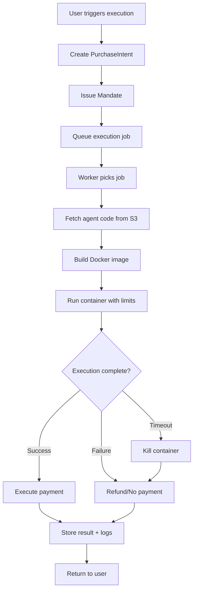

# FrameOS Agent Runtime Architecture (Phase 1)

**Version:** 1.0
**Date:** 2025-10-20
**Status:** Design Phase
**Target Launch:** 10 weeks from approval

---

## Table of Contents

1. [Executive Summary](#executive-summary)
2. [Architecture Overview](#architecture-overview)
3. [Component Architecture](#component-architecture)
4. [Execution Model](#execution-model)
5. [Agent Lifecycle](#agent-lifecycle)
6. [Security Architecture](#security-architecture)
7. [Payment Integration](#payment-integration)
8. [Database Schema](#database-schema)
9. [API Specification](#api-specification)
10. [Scaling Strategy](#scaling-strategy)
11. [Technology Stack](#technology-stack)

---

## Executive Summary

**Goal:** Build a marketplace platform (A-Layer + B-Layer) on top of the existing AP2 Payment Gateway (C-Layer) that allows:

- **Developers** to publish and monetize AI agents
- **Users** to discover, deploy, and execute agents
- **Platform** to orchestrate execution, handle payments, and ensure security

**Timeline:** 10 weeks to launch with 8 agents (3 native + 5 community)

**Key Metrics:**
- Agent execution time: < 5 minutes (hard timeout)
- Marketplace uptime: 99.9%
- Payment success rate: > 98%
- Code review time: < 24 hours for new agents

---

## Architecture Overview

### Three-Layer Architecture

```
┌─────────────────────────────────────────────────────────────┐
│                   A-LAYER: MARKETPLACE                      │
│  (Developer Portal, Agent Discovery, User Dashboard)       │
│                                                             │
│  Components:                                                │
│  - Next.js Frontend (Vercel)                               │
│  - Agent Registry API                                      │
│  - Search & Discovery Service                             │
│  - Developer Analytics Dashboard                           │
└─────────────────────────────────────────────────────────────┘
                          ↓ HTTP/REST
┌─────────────────────────────────────────────────────────────┐
│                B-LAYER: ORCHESTRATION                       │
│     (Agent Execution, Sandboxing, Monitoring)              │
│                                                             │
│  Components:                                                │
│  - Agent Execution Engine (Docker-based)                   │
│  - Sandbox Manager (Firecracker VMs)                       │
│  - Execution Queue (BullMQ + Redis)                        │
│  - Resource Monitor (CPU/Memory limits)                    │
│  - Code Scanner (AST analysis + pattern detection)         │
└─────────────────────────────────────────────────────────────┘
                          ↓ HTTP/REST
┌─────────────────────────────────────────────────────────────┐
│              C-LAYER: PAYMENT GATEWAY (EXISTING)            │
│   (PurchaseIntent → Mandate → Execute → Receipt)           │
│                                                             │
│  Status: ✅ PRODUCTION READY (174 tests, 94% coverage)     │
└─────────────────────────────────────────────────────────────┘
```

### System Architecture Diagram (ASCII)

```
┌──────────────────────────────────────────────────────────────────────┐
│                        FRAMEOS MARKETPLACE                           │
└──────────────────────────────────────────────────────────────────────┘

┌─────────────┐      ┌─────────────┐      ┌─────────────┐
│  Developer  │      │    User     │      │   Admin     │
│   Portal    │      │  Dashboard  │      │   Panel     │
└──────┬──────┘      └──────┬──────┘      └──────┬──────┘
       │                    │                    │
       │                    │                    │
       └────────────────────┼────────────────────┘
                            │
                            ↓
       ┌────────────────────────────────────────────────┐
       │          API Gateway (Express)                 │
       │  /agents, /executions, /developers, /analytics │
       └────────────────┬───────────────────────────────┘
                        │
        ┌───────────────┼───────────────┐
        │               │               │
        ↓               ↓               ↓
┌───────────────┐ ┌──────────┐ ┌─────────────────┐
│ Agent Registry│ │ Execution│ │  Developer      │
│   Service     │ │  Engine  │ │  Analytics      │
└───────┬───────┘ └────┬─────┘ └────────┬────────┘
        │              │                 │
        ↓              ↓                 ↓
┌──────────────────────────────────────────────┐
│           PostgreSQL Database                │
│  (Agents, Executions, Developers, Revenue)   │
└──────────────────────────────────────────────┘
                       │
                       ↓
        ┌──────────────────────────────┐
        │  Agent Code Storage (S3)     │
        └──────────────────────────────┘
                       │
                       ↓
        ┌──────────────────────────────┐
        │  Execution Sandbox           │
        │  (Docker + Firecracker)      │
        └──────────────┬───────────────┘
                       │
                       ↓
        ┌──────────────────────────────┐
        │  AP2 Payment Gateway         │
        │  (Mandate → Execute)         │
        └──────────────────────────────┘
```

---

## Component Architecture

### 1. Agent Registry Service

**Responsibilities:**
- Store agent metadata and manifests
- Manage agent versions (semantic versioning)
- Handle agent publishing workflow
- Serve agent discovery queries
- Track agent popularity and ratings

**Key Operations:**
- `publishAgent(manifest, code_tarball)` - Developer publishes new agent
- `searchAgents(query, filters)` - User searches marketplace
- `getAgentDetails(agent_id)` - Fetch full agent info
- `listVersions(agent_id)` - Get all versions of an agent
- `deprecateVersion(agent_id, version)` - Mark version as deprecated

### 2. Agent Execution Engine

**Responsibilities:**
- Execute agent code in isolated sandboxes
- Enforce resource limits (CPU, memory, network)
- Handle timeouts (5 min max)
- Capture stdout/stderr logs
- Return execution results to user

**Execution Flow:**
```
User triggers execution
    ↓
Payment pre-authorization (create mandate)
    ↓
Execution queued (BullMQ)
    ↓
Worker picks job from queue
    ↓
Fetch agent code from S3
    ↓
Spin up Docker container (with resource limits)
    ↓
Inject user inputs as environment variables
    ↓
Run agent code (timeout: 5 min)
    ↓
Capture output (stdout, stderr, exit code)
    ↓
Payment execution (if success)
    ↓
Store execution record (logs, result, duration)
    ↓
Return result to user
```

### 3. Sandbox Manager

**Responsibilities:**
- Manage Docker containers for agent execution
- Enforce security policies (no network, no filesystem access)
- Monitor resource usage
- Kill runaway processes
- Clean up containers after execution

**Sandbox Isolation Layers:**

| Layer | Technology | Purpose |
|-------|-----------|---------|
| Container | Docker | Process isolation, resource limits |
| Network | Docker network: none | Prevent unauthorized HTTP requests |
| Filesystem | Read-only container | Prevent malicious writes |
| CPU | Docker --cpus=1.0 | Limit to 1 vCPU |
| Memory | Docker --memory=512m | Limit to 512 MB RAM |
| Time | Process timeout | Kill after 5 minutes |

### 4. Code Scanner

**Responsibilities:**
- Static analysis of agent code before publishing
- Detect malicious patterns (crypto mining, file system access)
- Enforce code quality standards
- Flag suspicious dependencies

**Detection Patterns:**

| Pattern | Severity | Action |
|---------|----------|--------|
| `eval()`, `Function()` | HIGH | Reject |
| `require('fs')`, `import fs` | HIGH | Reject |
| `child_process.exec()` | HIGH | Reject |
| Cryptocurrency addresses | MEDIUM | Flag for review |
| Large files (>10MB) | MEDIUM | Flag for review |
| Obfuscated code | HIGH | Reject |
| Network libraries (axios, fetch) | LOW | Allow (with restrictions) |

### 5. Developer Analytics

**Responsibilities:**
- Track agent usage (executions per day)
- Calculate developer revenue
- Show success/failure rates
- Provide performance insights

**Metrics Tracked:**
- Total executions
- Revenue earned (per agent, per developer)
- Average execution time
- Success rate (%)
- User ratings

### 6. Execution Queue (BullMQ)

**Responsibilities:**
- Queue agent execution jobs
- Prioritize jobs (paid users > free tier)
- Retry failed executions (3 attempts)
- Handle concurrency limits

**Queue Configuration:**
```typescript
{
  limiter: {
    max: 10, // Max 10 concurrent executions
    duration: 1000, // Per second
  },
  defaultJobOptions: {
    attempts: 3,
    backoff: {
      type: 'exponential',
      delay: 2000, // 2s, 4s, 8s
    },
    timeout: 300000, // 5 minutes
  },
}
```

---

## Execution Model

### Decision: Docker Containers (Not Isolated Node.js Processes)

**Why Docker?**

✅ **Better isolation** - Containers provide kernel-level isolation
✅ **Resource limits** - CPU/memory limits enforced by cgroups
✅ **Network control** - Easy to disable network with `--network none`
✅ **Language agnostic** - Future support for Python, Go agents
✅ **Industry standard** - Well-understood, battle-tested

❌ **Alternative: Isolated Node.js processes (VM2, isolated-vm)**
- Weaker isolation (same kernel space)
- Harder to enforce resource limits
- Node.js-only (no Python/Go)
- More complex to prevent file system access

### Execution Lifecycle



### Resource Limits

| Resource | Limit | Enforcement |
|----------|-------|-------------|
| CPU | 1 vCPU | Docker `--cpus=1.0` |
| Memory | 512 MB | Docker `--memory=512m` |
| Disk | 100 MB | Docker `tmpfs` mount |
| Network | Disabled | Docker `--network=none` |
| Time | 5 minutes | Process timeout + SIGKILL |
| Concurrent executions | 10 per worker | BullMQ limiter |

### Long-Running Agents (>5 min)

**Phase 1:** Not supported (hard 5-minute timeout)

**Phase 2 (Future):**
- Agents declare `long_running: true` in manifest
- User pays for estimated duration upfront
- Execution runs in background
- User polls for results via `/executions/:id` endpoint
- Webhook notification when complete

---

## Agent Lifecycle

### Phase 1: Agent Development & Publishing

```
Developer creates agent locally
    ↓
Developer tests agent (unit tests)
    ↓
Developer packages agent (tar.gz with manifest.json)
    ↓
Developer registers account (POST /developers/register)
    ↓
Developer publishes agent (POST /agents/register)
    ↓
Platform scans code for malicious patterns
    ↓
Platform stores code in S3 (versioned)
    ↓
Platform stores manifest in database
    ↓
Agent status: "pending_review"
    ↓
Admin reviews agent (manual approval)
    ↓
Agent status: "published"
    ↓
Agent appears in marketplace
```

### Phase 2: Agent Deployment (User)

```
User browses marketplace
    ↓
User finds agent
    ↓
User reads agent description, pricing, reviews
    ↓
User clicks "Deploy Agent"
    ↓
Platform creates AgentDeployment record
    ↓
User configures inputs (e.g., API keys for LinkedIn)
    ↓
User saves deployment (status: "configured")
```

### Phase 3: Agent Execution

```
User clicks "Run Agent"
    ↓
Platform creates PurchaseIntent (C-Layer)
    ↓
Platform issues Mandate (C-Layer)
    ↓
Platform queues execution (BullMQ)
    ↓
Worker fetches job from queue
    ↓
Worker spins up Docker container
    ↓
Agent code runs (5 min max)
    ↓
Agent returns result
    ↓
Platform executes payment (C-Layer)
    ↓
Platform stores execution record
    ↓
Platform credits developer revenue
    ↓
User sees result in dashboard
```

### Phase 4: Agent Updates

```
Developer releases new version (1.1.0)
    ↓
Platform scans new code
    ↓
Platform stores new version in S3
    ↓
Platform updates manifest with new version
    ↓
User deployments remain on old version (1.0.0)
    ↓
User manually upgrades deployment to 1.1.0
    ↓
Future executions use new version
```

---

## Security Architecture

### 1. Agent Code Security

**Static Analysis (Pre-Publishing):**

```typescript
// Code scanner patterns
const DANGEROUS_PATTERNS = [
  /require\(['"]fs['"]\)/,                // File system access
  /import\s+.*\s+from\s+['"]fs['"]/,      // ES6 fs import
  /child_process/,                         // Shell execution
  /eval\(/,                                // Code injection
  /Function\(/,                            // Dynamic code
  /crypto\.(createHash|createCipher)/,     // Potential mining
  /0x[0-9a-fA-F]{40}/,                     // Ethereum addresses
  /bc1[a-zA-Z0-9]{39,59}/,                 // Bitcoin addresses
];

function scanCode(code: string): ScanResult {
  const violations = [];
  for (const pattern of DANGEROUS_PATTERNS) {
    if (pattern.test(code)) {
      violations.push({
        pattern: pattern.source,
        severity: 'HIGH',
        action: 'REJECT',
      });
    }
  }
  return { passed: violations.length === 0, violations };
}
```

**Runtime Sandboxing (During Execution):**

```bash
docker run \
  --network=none \              # No network access
  --read-only \                 # Read-only filesystem
  --tmpfs /tmp:size=100m \      # 100MB temp storage
  --cpus=1.0 \                  # 1 vCPU limit
  --memory=512m \               # 512MB RAM limit
  --memory-swap=512m \          # No swap
  --pids-limit=50 \             # Max 50 processes
  --cap-drop=ALL \              # Drop all capabilities
  --security-opt=no-new-privileges \
  --rm \                        # Auto-remove after exit
  agent-runtime:latest \
  node /agent/index.js
```

### 2. Data Security

**Sensitive Data Handling:**

| Data Type | Storage | Encryption | Access Control |
|-----------|---------|------------|----------------|
| Agent code | S3 (private) | AES-256 at rest | Developer + Admin only |
| User inputs | PostgreSQL (encrypted columns) | AES-256 | User + Execution engine only |
| API keys | PostgreSQL (encrypted) | AES-256 + env vars | Injected at runtime, never logged |
| Execution logs | S3 (private) | AES-256 | User + Developer (sanitized) |
| Payment data | C-Layer (existing) | Hash chain + signatures | C-Layer handles |

### 3. API Security

**Authentication Methods:**

| User Type | Method | Token Format |
|-----------|--------|--------------|
| Developer | JWT | `Bearer eyJhbGci...` |
| End User | JWT | `Bearer eyJhbGci...` |
| Agent (execution) | Short-lived token | `Bearer exec_...` (5 min TTL) |
| Admin | JWT + 2FA | `Bearer eyJhbGci...` |

**Rate Limiting:**

| Endpoint | Limit | Window |
|----------|-------|--------|
| POST /agents/register | 10 | 1 hour |
| POST /agents/:id/execute | 100 | 1 hour (per user) |
| GET /agents | 1000 | 1 hour |
| GET /executions/:id | 500 | 1 hour |

### 4. Threat Mitigation

| Threat | Risk Level | Mitigation |
|--------|-----------|------------|
| Malicious code execution | HIGH | Code scanning + Docker sandboxing |
| Resource exhaustion (CPU mining) | HIGH | CPU/memory/time limits |
| Data exfiltration | MEDIUM | Network disabled, logs sanitized |
| Stolen API keys | MEDIUM | Encrypted storage, short-lived tokens |
| DDoS on execution queue | MEDIUM | Rate limiting, job prioritization |
| Agent code tampering | MEDIUM | S3 versioning, hash verification |
| Payment fraud | LOW | C-Layer handles (mandate signatures) |

---

## Payment Integration

### Payment Flow (Integration with C-Layer)

```
User initiates agent execution
    ↓
Platform calculates cost (from agent manifest)
    ↓
Platform creates PurchaseIntent (C-Layer API)
    POST /purchase-intents
    {
      "agent_id": "agt_user_123",
      "vendor": "frameos_marketplace",
      "amount": 50,  // 50 paise = ₹0.50
      "currency": "INR",
      "description": "LinkedIn Outreach Agent execution",
      "metadata": {
        "execution_id": "exec_abc123",
        "agent_definition_id": "agt_linkedin_outreach"
      }
    }
    ↓
C-Layer returns intent_id
    ↓
Platform creates Mandate (C-Layer API)
    POST /mandates
    {
      "intent_id": "pi_xyz789"
    }
    ↓
C-Layer validates policy, signs mandate
C-Layer returns mandate_id + signature
    ↓
Platform queues execution job
    ↓
Agent executes (5 min max)
    ↓
If successful:
    Platform executes payment (C-Layer API)
    POST /execute
    {
      "mandate_id": "mdt_abc123"
    }
    ↓
    C-Layer routes payment (Stripe/Cashfree/x402)
    C-Layer returns payment_id + receipt_id
    ↓
If failed:
    Platform does NOT execute payment
    (No mandate execution = no charge)
    ↓
Platform stores execution result
    ↓
Platform credits developer revenue
    Developer earns: 70% of payment
    Platform keeps: 20%
    Orchestrator earns: 10%
```

### Pricing Models Supported

| Model | Description | Example | Implementation |
|-------|-------------|---------|----------------|
| Per-Execution | Fixed price per run | ₹0.50 per execution | Single payment per execution |
| Pay-Per-Use | Variable based on usage | ₹0.10 per API call | Metered billing (Phase 2) |
| Subscription | Monthly access | ₹100/month for unlimited runs | Recurring mandate (Phase 2) |
| Free Tier | First N executions free | 10 free runs/month | Track usage, skip payment |

### Revenue Split

```
Total Payment: ₹1.00 (100 paise)
    ├── Developer: ₹0.70 (70%)
    ├── Platform: ₹0.20 (20%)
    └── Orchestrator: ₹0.10 (10%)
```

**Payout Mechanism (Phase 2):**
- Developers accumulate revenue in `DeveloperRevenue` table
- Minimum payout threshold: ₹500
- Payout frequency: Weekly (every Monday)
- Payment method: UPI, Bank transfer (via Cashfree Payouts)

---

## Database Schema

### New Models (Phase 1)

```prisma
// Developer who publishes agents
model Developer {
  id              String   @id @default(cuid())
  email           String   @unique
  name            String
  company         String?
  password_hash   String
  status          String   @default("active") // active, suspended, banned
  verified_email  Boolean  @default(false)
  created_at      DateTime @default(now())
  updated_at      DateTime @updatedAt

  agents          AgentDefinition[]
  revenue         DeveloperRevenue[]

  @@index([email])
  @@index([status])
  @@map("developers")
}

// Agent definition (metadata + code reference)
model AgentDefinition {
  id                String   @id @default(cuid())
  developer_id      String
  name              String
  slug              String   @unique // linkedin-outreach-agent
  description       String
  long_description  String?  // Markdown
  icon_url          String?
  category          String   // automation, data-enrichment, outreach, etc.

  // Pricing
  pricing_model     String   // per_execution, subscription, pay_per_use
  price_amount      Int      // In minor units (paise)
  price_currency    String   @default("INR")

  // Versioning
  current_version   String   // Semantic version (1.2.3)

  // Metadata
  tags              Json     @default("[]") // ["linkedin", "outreach", "b2b"]
  capabilities      Json     @default("[]") // ["http_request", "browser"]

  // Stats
  total_executions  Int      @default(0)
  success_rate      Float    @default(0.0)
  avg_duration_ms   Int      @default(0)
  rating            Float    @default(0.0)
  review_count      Int      @default(0)

  // Status
  status            String   @default("pending_review") // pending_review, published, deprecated, banned

  created_at        DateTime @default(now())
  updated_at        DateTime @updatedAt

  developer         Developer @relation(fields: [developer_id], references: [id], onDelete: Cascade)
  versions          AgentVersion[]
  deployments       AgentDeployment[]
  executions        AgentExecution[]

  @@index([developer_id])
  @@index([status])
  @@index([category])
  @@index([slug])
  @@map("agent_definitions")
}

// Agent version (each publish creates new version)
model AgentVersion {
  id                String   @id @default(cuid())
  agent_id          String
  version           String   // Semantic version (1.2.3)
  manifest          Json     // Full manifest.json
  code_s3_key       String   // S3 key for code tarball
  code_hash         String   // SHA256 hash of code

  // Runtime config
  runtime_language  String   @default("nodejs")
  runtime_version   String   @default("20")
  entrypoint        String   @default("index.js")
  timeout_ms        Int      @default(300000) // 5 minutes
  memory_mb         Int      @default(512)

  // Inputs/Outputs schema
  inputs_schema     Json     // JSON Schema for inputs
  outputs_schema    Json     // JSON Schema for outputs

  // Security scan results
  scan_passed       Boolean  @default(false)
  scan_report       Json?

  status            String   @default("active") // active, deprecated
  created_at        DateTime @default(now())

  agent             AgentDefinition @relation(fields: [agent_id], references: [id], onDelete: Cascade)

  @@unique([agent_id, version])
  @@index([agent_id, status])
  @@map("agent_versions")
}

// User deploys agent to their account (config stored here)
model AgentDeployment {
  id                String   @id @default(cuid())
  user_id           String   // References Agent model (existing C-Layer)
  agent_id          String
  version           String   // Which version deployed

  // User configuration
  config            Json     @default("{}") // User's input values (API keys, etc.)

  status            String   @default("configured") // configured, paused, deleted
  created_at        DateTime @default(now())
  updated_at        DateTime @updatedAt

  agent             AgentDefinition @relation(fields: [agent_id], references: [id], onDelete: Cascade)
  executions        AgentExecution[]

  @@index([user_id])
  @@index([agent_id])
  @@map("agent_deployments")
}

// Execution log (one per agent run)
model AgentExecution {
  id                String    @id @default(cuid())
  deployment_id     String
  agent_id          String
  user_id           String    // References Agent model (existing C-Layer)

  // Payment linkage
  purchase_intent_id String?  // Links to PurchaseIntent (C-Layer)
  mandate_id         String?  // Links to Mandate (C-Layer)
  payment_id         String?  // Links to Payment (C-Layer)

  // Execution details
  inputs            Json      // User-provided inputs
  outputs           Json?     // Agent outputs (if successful)

  // Runtime metrics
  status            String    @default("queued") // queued, running, success, failed, timeout
  started_at        DateTime?
  completed_at      DateTime?
  duration_ms       Int?

  // Logs
  stdout            String?   // Agent stdout (max 10KB)
  stderr            String?   // Agent stderr (max 10KB)
  error_message     String?
  exit_code         Int?

  created_at        DateTime  @default(now())

  deployment        AgentDeployment @relation(fields: [deployment_id], references: [id], onDelete: Cascade)
  agent             AgentDefinition @relation(fields: [agent_id], references: [id], onDelete: Cascade)

  @@index([user_id, created_at])
  @@index([agent_id, status])
  @@index([deployment_id])
  @@index([status, created_at])
  @@map("agent_executions")
}

// Developer revenue tracking
model DeveloperRevenue {
  id                String   @id @default(cuid())
  developer_id      String
  agent_id          String?  // Which agent earned this
  execution_id      String?  // Which execution generated this

  amount            Int      // In minor units (paise)
  currency          String   @default("INR")

  status            String   @default("pending") // pending, paid_out
  paid_out_at       DateTime?

  created_at        DateTime @default(now())

  developer         Developer @relation(fields: [developer_id], references: [id], onDelete: Cascade)

  @@index([developer_id, status])
  @@index([created_at])
  @@map("developer_revenue")
}
```

### Relationships with Existing C-Layer Models

```
Existing C-Layer Models:
- Agent (user account)
- Policy (spending policies)
- PurchaseIntent
- Mandate
- Payment
- Receipt

New A/B-Layer Models:
- Developer
- AgentDefinition
- AgentVersion
- AgentDeployment
- AgentExecution
- DeveloperRevenue

Linkage:
AgentExecution.user_id → Agent.id (C-Layer)
AgentExecution.purchase_intent_id → PurchaseIntent.id (C-Layer)
AgentExecution.mandate_id → Mandate.id (C-Layer)
AgentExecution.payment_id → Payment.id (C-Layer)
```

---

## API Specification

### Base URL
```
Production: https://api.frameos.dev
Staging: https://api-staging.frameos.dev
```

### Authentication
All endpoints require JWT in `Authorization: Bearer <token>` header.

---

### Agent Registry Endpoints

#### 1. POST /agents/register
**Description:** Developer publishes a new agent

**Request:**
```json
{
  "name": "LinkedIn Cold Outreach Agent",
  "slug": "linkedin-outreach-agent",
  "description": "Automate LinkedIn connection requests",
  "long_description": "# LinkedIn Outreach\n\nThis agent...",
  "category": "outreach",
  "pricing_model": "per_execution",
  "price_amount": 50,
  "price_currency": "INR",
  "version": "1.0.0",
  "manifest": {
    "runtime": {
      "language": "nodejs",
      "version": "20",
      "entrypoint": "index.js",
      "timeout_ms": 300000,
      "memory_mb": 512
    },
    "inputs": [
      {
        "name": "target_profile_url",
        "type": "string",
        "required": true,
        "description": "LinkedIn profile URL"
      }
    ],
    "outputs": [
      {
        "name": "connection_sent",
        "type": "boolean"
      }
    ],
    "capabilities": ["http_request"]
  },
  "code_base64": "H4sIAAAAAAAAA..." // Base64-encoded tar.gz
}
```

**Response (201 Created):**
```json
{
  "success": true,
  "data": {
    "agent_id": "agt_def_abc123",
    "version_id": "ver_xyz789",
    "status": "pending_review",
    "scan_passed": true,
    "message": "Agent submitted for review. Approval within 24 hours."
  }
}
```

**Idempotency:** Required (`Idempotency-Key` header)

**Rate Limit:** 10 requests/hour

---

#### 2. GET /agents
**Description:** List all agents (marketplace discovery)

**Query Parameters:**
```
?category=outreach
&search=linkedin
&pricing_model=per_execution
&sort=popularity  // popularity, newest, price_low, price_high, rating
&page=1
&limit=20
```

**Response (200 OK):**
```json
{
  "success": true,
  "data": {
    "agents": [
      {
        "id": "agt_def_abc123",
        "name": "LinkedIn Cold Outreach Agent",
        "slug": "linkedin-outreach-agent",
        "description": "Automate LinkedIn connection requests",
        "icon_url": "https://cdn.frameos.dev/icons/linkedin.png",
        "category": "outreach",
        "pricing_model": "per_execution",
        "price_amount": 50,
        "price_currency": "INR",
        "current_version": "1.2.3",
        "rating": 4.8,
        "review_count": 142,
        "total_executions": 5230,
        "developer": {
          "id": "dev_123",
          "name": "John Doe"
        }
      }
    ],
    "total": 127,
    "page": 1,
    "limit": 20
  }
}
```

**Rate Limit:** 1000 requests/hour

---

#### 3. GET /agents/:slug
**Description:** Get agent details

**Response (200 OK):**
```json
{
  "success": true,
  "data": {
    "id": "agt_def_abc123",
    "name": "LinkedIn Cold Outreach Agent",
    "slug": "linkedin-outreach-agent",
    "description": "Automate LinkedIn connection requests",
    "long_description": "# LinkedIn Outreach\n\nThis agent...",
    "icon_url": "https://cdn.frameos.dev/icons/linkedin.png",
    "category": "outreach",
    "pricing_model": "per_execution",
    "price_amount": 50,
    "price_currency": "INR",
    "current_version": "1.2.3",
    "rating": 4.8,
    "review_count": 142,
    "total_executions": 5230,
    "success_rate": 0.96,
    "avg_duration_ms": 12500,
    "tags": ["linkedin", "outreach", "b2b"],
    "capabilities": ["http_request"],
    "manifest": {
      "inputs": [...],
      "outputs": [...],
      "runtime": {...}
    },
    "developer": {
      "id": "dev_123",
      "name": "John Doe",
      "company": "Acme Inc"
    },
    "created_at": "2025-09-01T10:00:00Z",
    "updated_at": "2025-10-15T14:30:00Z"
  }
}
```

---

#### 4. POST /agents/:id/deploy
**Description:** User deploys agent to their account

**Request:**
```json
{
  "version": "1.2.3",
  "config": {
    "linkedin_session_cookie": "AQEDARqS...",
    "max_requests_per_day": 50
  }
}
```

**Response (201 Created):**
```json
{
  "success": true,
  "data": {
    "deployment_id": "dep_xyz789",
    "agent_id": "agt_def_abc123",
    "version": "1.2.3",
    "status": "configured",
    "message": "Agent deployed successfully. Ready to execute."
  }
}
```

**Idempotency:** Required

---

#### 5. POST /agents/:id/execute
**Description:** Trigger agent execution

**Request:**
```json
{
  "deployment_id": "dep_xyz789",
  "inputs": {
    "target_profile_url": "https://linkedin.com/in/johndoe"
  }
}
```

**Response (202 Accepted):**
```json
{
  "success": true,
  "data": {
    "execution_id": "exec_abc123",
    "status": "queued",
    "estimated_duration_ms": 15000,
    "poll_url": "/executions/exec_abc123",
    "message": "Execution queued. Check status at poll_url."
  }
}
```

**Idempotency:** Required

**Rate Limit:** 100 requests/hour per user

---

### Execution Endpoints

#### 6. GET /executions/:id
**Description:** Get execution status and results

**Response (200 OK - Running):**
```json
{
  "success": true,
  "data": {
    "id": "exec_abc123",
    "agent_id": "agt_def_abc123",
    "agent_name": "LinkedIn Cold Outreach Agent",
    "status": "running",
    "started_at": "2025-10-20T15:30:00Z",
    "elapsed_ms": 8500,
    "inputs": {
      "target_profile_url": "https://linkedin.com/in/johndoe"
    }
  }
}
```

**Response (200 OK - Success):**
```json
{
  "success": true,
  "data": {
    "id": "exec_abc123",
    "status": "success",
    "started_at": "2025-10-20T15:30:00Z",
    "completed_at": "2025-10-20T15:30:12Z",
    "duration_ms": 12340,
    "inputs": {
      "target_profile_url": "https://linkedin.com/in/johndoe"
    },
    "outputs": {
      "connection_sent": true,
      "message": "Connection request sent successfully"
    },
    "payment": {
      "amount": 50,
      "currency": "INR",
      "receipt_id": "rcpt_xyz789"
    }
  }
}
```

**Response (200 OK - Failed):**
```json
{
  "success": true,
  "data": {
    "id": "exec_abc123",
    "status": "failed",
    "started_at": "2025-10-20T15:30:00Z",
    "completed_at": "2025-10-20T15:30:08Z",
    "duration_ms": 8200,
    "error_message": "LinkedIn session expired. Please update credentials.",
    "exit_code": 1,
    "payment": null
  }
}
```

---

### Developer Endpoints

#### 7. POST /developers/register
**Description:** Register new developer account

**Request:**
```json
{
  "email": "dev@example.com",
  "name": "John Doe",
  "password": "SecurePass123!",
  "company": "Acme Inc"
}
```

**Response (201 Created):**
```json
{
  "success": true,
  "data": {
    "developer_id": "dev_123",
    "email": "dev@example.com",
    "message": "Account created. Please verify your email."
  }
}
```

---

#### 8. GET /developers/analytics
**Description:** Developer sees their agent analytics

**Response (200 OK):**
```json
{
  "success": true,
  "data": {
    "total_revenue": 125000, // ₹1250 in paise
    "pending_payout": 85000, // ₹850
    "total_executions": 2500,
    "agents": [
      {
        "id": "agt_def_abc123",
        "name": "LinkedIn Outreach Agent",
        "executions": 1800,
        "revenue": 90000,
        "success_rate": 0.96,
        "avg_duration_ms": 12500
      }
    ],
    "recent_executions": [
      {
        "id": "exec_abc123",
        "agent_name": "LinkedIn Outreach Agent",
        "status": "success",
        "revenue": 50,
        "created_at": "2025-10-20T15:30:00Z"
      }
    ]
  }
}
```

---

## Scaling Strategy

### Phase 1 (MVP - 100 users)
```
Infrastructure:
- 1 API server (Railway, 2GB RAM)
- 2 Execution workers (Railway, 4GB RAM each)
- PostgreSQL (Neon, serverless)
- Redis (Railway, 1GB)
- S3-compatible storage (Cloudflare R2)

Cost: ~$50/month
```

### Phase 2 (Growth - 1000 users)
```
Infrastructure:
- 3 API servers (load balanced)
- 10 Execution workers (auto-scaling)
- PostgreSQL read replicas
- Redis cluster (3 nodes)
- CDN for static assets

Cost: ~$300/month
```

### Phase 3 (Scale - 10,000+ users)
```
Infrastructure:
- Kubernetes cluster (10+ nodes)
- Separate execution cluster (Firecracker VMs)
- PostgreSQL sharding by user_id
- Redis Cluster (6+ nodes)
- Multi-region deployment

Cost: ~$2000/month
```

---

## Technology Stack

### Backend (B-Layer)
- **Node.js 20+** - Runtime
- **Express 4.x** - API framework
- **Prisma 5.x** - ORM
- **BullMQ** - Job queue
- **Redis 7.x** - Queue storage + caching
- **Docker 24+** - Container runtime
- **Firecracker (Phase 2)** - VM isolation

### Frontend (A-Layer)
- **Next.js 14** - React framework
- **TypeScript 5.x** - Type safety
- **Tailwind CSS** - Styling
- **shadcn/ui** - Component library
- **React Query** - Data fetching
- **Zustand** - State management

### Infrastructure
- **PostgreSQL 14+** - Primary database
- **Railway** - Hosting (API + Workers)
- **Vercel** - Frontend hosting
- **Cloudflare R2** - Object storage (agent code)
- **Neon** - Serverless Postgres
- **Sentry** - Error tracking
- **Plausible** - Analytics

### Security
- **@noble/curves** - Ed25519 signatures
- **bcrypt** - Password hashing
- **jose** - JWT handling
- **helmet** - Security headers
- **express-rate-limit** - Rate limiting

---

**End of Architecture Document**

For implementation details, see:
- `/docs/agent-runtime-decisions.md` - Design decisions
- `/packages/domain/src/agent-manifest.ts` - Agent manifest schema
- `/docs/api/agent-endpoints.yaml` - OpenAPI specification
